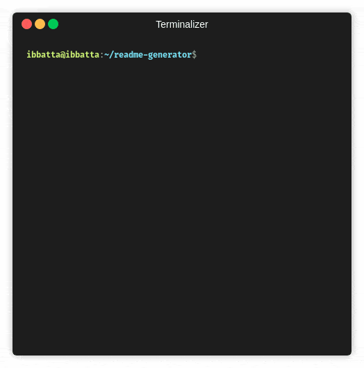

# **:triangular_flag_on_post: README GENERATOR**


[](https://twitter.com/battago)

> This project was born mainly to satisfy my desire for knowledge and to simplify my workflow. Being a curious (and also lazy) developer I have always wondered how to avoid wasting my working time to write README.md files who fits perfectly project by project and that's why I wrote a tool to help me simplify and speed up these processes.



---

## **:clipboard: User usage**

Install globally `npm i -g @ibbatta/readme-generator`.\
Install locally `npm i --save-dev @ibbatta/readme-generator`.\
Just run `readme-generator` at the root of your project and answer questions.

You can add few options:

| Option         | Description                                  | Default                     |
| -------------- | -------------------------------------------- | --------------------------- |
| -V, --version  | output the version number                    |                             |
| -h, --help     | output usage information                     |                             |
| -o, --output   | specify the output file                      | `README.md`                 |
| -t, --template | specify the path for you own README template | `internal default template` |
| -d, --debug    | log output readme data                       | `false`                     |

The tools will look for the **name**, **version**, **description**, **respository**, **author**, **engines**, **dependencies** and **contributors** data inside you package.json and then will generate the README.md file based on that informations.

_NOTE_: To generate a complete `README.md`, be sure that the structure of your package.json looks like this:

```js
{
    "name": "PROJECT NAME",
    "version": "PROJECT VERSION",
    "description": "LONG PROJECT DESCRIPTION",
    "repository": {
        "url": "REPOSITORY URL"
    },
    "author": {
        "name": "AUTHOR FULL NAME",
        "email": "AUTHOR EMAIL ADDRESS",
        "url": "AUTHOR URL",
        "social": {
            "github": "...",
            "twitter": "...",
            "ADD MORE SOCIAL IF YOU WANT": "..."
        }
    },
    "contributors": [{
        "name": "CONTRIBUTOR FULL NAME",
        "url": "CONTRIBUTOR URL",
        "reason": "THE REASON WHY YOU HAVE ADDED THIS CONTRIBUTOR AND/OR HIS HELP TO THE PROJECT"
    }],
    "engines": {
       ...
    },
    "dependencies": {
        ...
    }
}

```

I've added two custom fields inside the package.json:

- SOCIAL (inside author)
- REASON (inside each contributor)

This allow the tool to create a better README with more cool informations.

---

## **:wrench: Developer usage**

### **Set up project**

Before cloning the repo **be sure** you have installed:

- [**NODE**](https://www.google.com/search?q=how+to+install+node) (version >= 9.10.x)
- [**YARN**](https://www.google.com/search?q=how+to+install+yarn) (version >= 1.9.x)
- [**NPM**](https://www.google.com/search?q=how+to+install+npm) (version >= 6.3.x)

Then:

- Choose a folder project in your system and switch in `cd [folder path]`
- Clone the repo in your folder `git clone https://github.com/ibbatta/readme-generator.git`

---

### **Installation**

First of all enter in the project folder and run `nvm use` to have the right node version for the project, then run `yarn install` to install all the dependencies.

---

#### Start the project

It will run the cli of the project locally

```bash
npm start
# or
yarn start
```

#### Build the project for production

It will create a folder `/lib` and compile the es6 / es7 js syntax

```bash
npm build
#or
yarn build
```

You can add the `--watch` flag if you want keep watching changes for test files.

#### Run the tests

```bash
npm test
#or
yarn test
```

You can add the `--watch` flag if you want keep watching changes for test files.

---

## **Editor setup**

To keep consistency to the style of resources, I decided to stick to some shared rules that have to be applied to every
project using some editors plugins. Plese be sure to disable / remove any other js/jsx linters or custom configurations.

### Eslint

I have chose to use [Eslint](https://eslint.org/) to check on Javascript / React [.js / .jsx] syntax.
It works including a `.eslintrc` file in the root directory and making sure your editor has the necessary plugin.

### Auto correction on save

I have chose to use [js-beautify](https://github.com/beautify-web/js-beautify/) as a beautifier also for HTML and CSS.
It works including a `.jsbeautifyrc` file in the root directory and making sure your editor has the necessary plugin.

### Basic Editor Configuration

I have chose to use [EditorConfig](https://editorconfig.org/) to share the basic configuration like indentation and
charset.
It works including an `.editorconfig` file in the root directory and making sure your editor has the necessary plugin.

### Prettier

I have chose to use [Prettier](https://prettier.io/) to ensure the codebase with a consistent style.
It works including a `.prettierrc` file in the root directory and making sure your editor has the necessary plugin.

---

## **:handshake: Contributing**

Contributions, issues and feature requests are welcome.\
Feel free to check issues page if you want to contribute and follow these simple steps:

- Fork it!
- Create your feature (or fix) branch: `git checkout -b my-new-feature`
- Commit your changes: `git commit -am 'Add some feature'`
- Push to the branch: `git push origin my-new-feature`
- Submit a pull request

---

### **:anger: Troubleshootings**

This is just a personal project created for study / demonstration purpose and to simplify my working life, it may or may not be a good fit for your project(s).

---

### **:heart: Show your support**

Please :star: this repository if you like it or this project helped you!\
Feel free to open issues or submit pull-requests to help me improving my work.

<a href="https://www.patreon.com/ibbatta" target="_blank">
  
</a>

---

### **:robot: Author**

Maurizio Battaghini

> GitHub [@ibbatta](https://github.com/ibbatta) &nbsp;&middot;&nbsp;
> Twitter [@battago](https://twitter.com/battago)

---

Copyright © 2019 [Maurizio Battaghini](https://github.com/ibbatta).\
This project is covered by [MIT](https://github.com/ibbatta/readme-generator/blob/develop/LICENSE) license.
